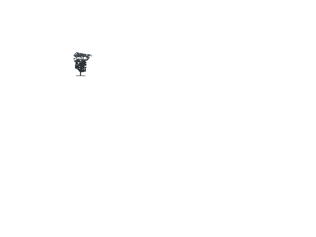
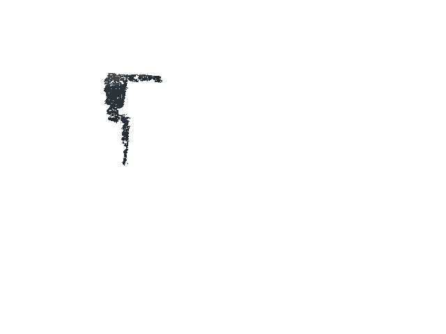

<div align="center">
  

  # Robot Motion Player

  **Visualise • Tune • Validate Robot Motion Data**

  [![CI Status][ci-badge]][ci-url]
  [![License][license-badge]](LICENSE)
  [![Python][python-badge]](https://www.python.org/)
  [![GitHub Stars][star-badge]][star-url]
  [![GitHub Forks][fork-badge]][fork-url]
  [![Contributors][contrib-badge]][contrib-url]

  [English](README.md) | [中文](README_zh.md)
</div>

---

## Overview

Robot Motion Player is a standalone, cross-platform Python tool for visualizing, editing, and quality assessment of robot motion datasets. It supports AMP-format data and whole-body trajectory optimization results.

**Key capabilities:**

- 🎬 **Playback** — MuJoCo-first real-time motion playback
- 🎚️ **IK Tuning** — 6D end-effector pose adjustment
- 📊 **Metrics** — AMP-aligned quality evaluation
- ✏️ **Editing** — Keyframe-safe trajectory editing
- 🔄 **Convert** — URDF/XML format conversion
- 📤 **Export** — GIF/Video output

**Use cases:**

- AMP locomotion learning pipeline (GMR → rsl-rl-ex → training)
- Trajectory optimization visualization and debugging
- Motion data quality control before expensive GPU training
- Robot motion algorithm development

---

## Demo

<table>
<tr>
<td width="50%" align="center"><b>Playback + Control</b></td>
<td width="50%" align="center"><b>IK Tuning</b></td>
</tr>
<tr>
<td></td>
<td></td>
</tr>
<tr>
<td align="center"><b>Metrics Report</b></td>
<td align="center"><b>GUI Workbench</b></td>
</tr>
<tr>
<td></td>
<td></td>
</tr>
</table>

---

## Features

| Module | Features | Status |
|--------|----------|--------|
| 📽️ **Playback** | Real-time playback, keyboard control, marked frames | ✅ |
| 🎚️ **IK Tuning** | 6D target pose, unit-aware controls, Jacobian-based | ✅ |
| 📊 **Metrics** | AMP quality terms, GMR loss parity, JSON/CSV export | ✅ |
| ✏️ **Editing** | Frame/segment editing, undo/redo, cross-frame propagation | ✅ |
| 🔄 **Convert** | URDF↔XML, MuJoCo format support | ✅ |
| 📤 **Export** | GIF, MP4, frame sequences | ✅ |
| 🖥️ **GUI** | Full workbench with tabs (Play/Tune/Metrics/Audit) | ✅ |

---

## 📦 Installation
> PyPI packages are pending approval, source installation is recommended for now:

### 用户安装（直接使用）
```bash
git clone https://github.com/bitroboticslab/robot-motion-player.git
cd robot-motion-player
pip install ".[all]"
```

### 开发者安装（参与贡献）
```bash
git clone https://github.com/bitroboticslab/robot-motion-player.git
cd robot-motion-player
conda create -n rmp python=3.11 -y
conda activate rmp
conda install -c conda-forge pinocchio
pip install -e ".[all,dev]"
pre-commit install
```

### From Scripts (Linux, macOS, Windows)

For a smoother setup experience, platform-specific scripts are provided:

```bash
# Linux
chmod +x scripts/setup_linux.sh
bash scripts/setup_linux.sh

# macOS
chmod +x scripts/setup_mac.sh
bash scripts/setup_mac.sh

# Windows
scripts\setup_windows.bat
```

### From Source Manually (Linux, macOS, Windows)

```bash
git clone https://github.com/bitroboticslab/robot-motion-player.git
cd robot-motion-player
conda create -n rmp python=3.11 -y
conda activate rmp
# recommended for windows to avoid compile from scratch
conda install -c conda-forge pinocchio
pip install -e ".[all]"
```

## Quick Start
### 🚀 2-Line Quick Run
```bash
git clone https://github.com/bitroboticslab/robot-motion-player.git && cd robot-motion-player
pip install ".[all]" && motion_player gui --motion example/standard_dataset/run1_subject5_standard.pkl --robot example/robots/booster_t1/T1_23dof.xml
```


### Try with Example Data

```bash
# Clone repository
git clone https://github.com/bitroboticslab/robot-motion-player.git
cd robot-motion-player

# Basic playback
motion_player play \
  --motion example/standard_dataset/run1_subject5_standard.pkl \
  --robot example/robots/booster_t1/T1_23dof.xml

# GUI mode
motion_player gui \
  --motion example/standard_dataset/run1_subject5_standard.pkl \
  --robot example/robots/booster_t1/T1_23dof.xml

# Quality metrics
motion_player metrics \
  --motion example/standard_dataset/run1_subject5_standard.pkl \
  --output report.json
```

---

## Documentation

- 📖 [Quick Start Guide](docs/QUICKSTART_en.md)
- 📖 [快速上手](docs/QUICKSTART_zh.md)
- 📖 [IK Usage Guide](docs/IK_USAGE.md)

---

## Integration

Robot Motion Player is designed to integrate with:

| Project | Role |
|---------|------|
| [GMR](https://github.com/YanjieZe/GMR) | Human-to-robot motion retargeting |
| [rsl-rl-ex](https://github.com/Mr-tooth/rsl-rl-ex) | AMP dataset building and training |
| [Pinocchio](https://github.com/stack-of-tasks/pinocchio) | IK backend (optional) |

---

## ❓ Frequently Asked Questions
### Q1: Installation fails with Pinocchio related errors?
A: We recommend using Conda to install Pinocchio first: `conda install -c conda-forge pinocchio` before running `pip install`. For Windows users, this avoids compilation errors entirely.
### Q2: Runtime error "file not found" for motion/robot files?
A: Make sure you are running the command from the root of the cloned repository, or use absolute paths for the `--motion` and `--robot` parameters.
### Q3: GUI fails to start or shows black screen?
A: Ensure you have OpenGL 3.3+ support. For headless servers, use `xvfb-run` to run GUI commands in virtual display: `xvfb-run motion_player gui ...`
### Q4: Video/GIF export fails?
A: Install required system dependency: `ffmpeg` (required for video export). GIF export uses built-in PIL library and has no extra system dependencies.
### Q5: Chinese path errors on Windows?
A: Move the repository to a path without Chinese characters, or upgrade your Python version to 3.11+.

## Citing

If you use Robot Motion Player in your research, please cite:

```bibtex
@software{rmp2026,
  author = {Lai, Junhang and contributors},
  title = {Robot Motion Player: A Visualizer and Editor for Robot Motion Data},
  howpublished = {https://github.com/bitroboticslab/robot-motion-player},
  year = {2026}
}
```

---

## Contributing

We welcome contributions! Please see [CONTRIBUTING.md](CONTRIBUTING.md) for guidelines.

---

## License

Apache 2.0 — see [LICENSE](LICENSE).

---

## Acknowledgments

Built upon the shoulders of:
- [Pinocchio](https://github.com/stack-of-tasks/pinocchio) — Rigid body dynamics
- [MuJoCo](https://github.com/google-deepmind/mujoco) — Physics simulation
- [GMR](https://github.com/YanjieZe/GMR) — Motion retargeting

<!-- Links -->
[ci-badge]: https://github.com/bitroboticslab/robot-motion-player/actions/workflows/ci.yml/badge.svg
[ci-url]: https://github.com/bitroboticslab/robot-motion-player/actions/workflows/ci.yml
[star-badge]: https://img.shields.io/github/stars/bitroboticslab/robot-motion-player
[star-url]: https://github.com/bitroboticslab/robot-motion-player/stargazers
[fork-badge]: https://img.shields.io/github/forks/bitroboticslab/robot-motion-player
[fork-url]: https://github.com/bitroboticslab/robot-motion-player/network/members
[contrib-badge]: https://img.shields.io/github/contributors/bitroboticslab/robot-motion-player
[contrib-url]: https://github.com/bitroboticslab/robot-motion-player/graphs/contributors
[license-badge]: https://img.shields.io/badge/License-Apache%202.0-blue.svg
[python-badge]: https://img.shields.io/badge/Python-3.9%2B-blue
